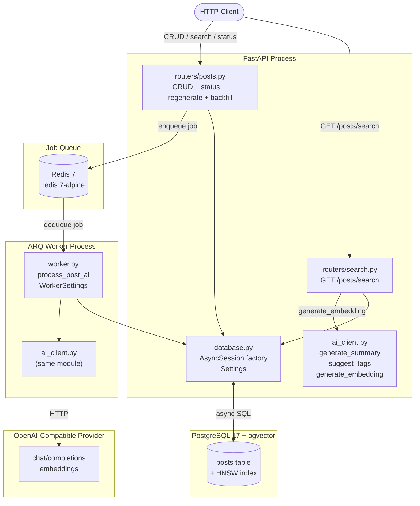

# Design Document — Blog API AI Features (Phase 5)

## Overview

Phase 5 adds two AI-powered capabilities on top of the existing FastAPI + PostgreSQL CRUD service:

1. **LLM Writing Assistant** — each post creation or content-changing update triggers a background ARQ job that calls an OpenAI-compatible provider to generate a plain-language summary and a list of keyword tags, then persists the results.

2. **Semantic Search** — every post receives a text embedding (also produced by the background job). A new `GET /posts/search?q=` endpoint converts the natural-language query into an embedding on-the-fly and returns posts ranked by cosine similarity using pgvector.

Underpinning both features are three cross-cutting changes:
- **Async database layer** — the sync SQLAlchemy engine and session are replaced by `create_async_engine` + `AsyncSession` so that background callbacks and HTTP handlers share the event loop without blocking it.
- **Alembic migrations** — `Base.metadata.create_all()` is removed; all schema changes (baseline + AI columns) are delivered as reproducible, reversible Alembic migrations.
- **Configurable AI client** — a single `ai_client.py` module wraps `AsyncOpenAI`, supporting any OpenAI-compatible router (LiteLLM, OpenRouter, Ollama, vLLM) via `ai_base_url` + `ai_api_key` settings.

---

## Architecture



### Request flow — post creation

```
POST /posts/
  │
  ├─► INSERT post row (AsyncSession)
  ├─► enqueue AI_Enrichment_Job(post_id) → Redis
  └─► return 201 PostResponse (summary/tags/ai_processed_at all null)

[async, separately]
ARQ Worker dequeues job
  ├─► generate_summary(title, content)
  ├─► suggest_tags(title, content)
  ├─► generate_embedding(title + " " + content)
  └─► UPDATE posts SET summary=…, tags=…, embedding=…, ai_processed_at=now()
```

---

## Components and Interfaces

### `src/blogs_api/database.py` (updated)

Replaces the sync engine with an async one. The `Settings` class gains AI and Redis fields.

```python
# Key exports
settings: Settings                          # singleton settings object
async_engine: AsyncEngine                   # create_async_engine(...)
AsyncSessionLocal: async_sessionmaker       # factory for AsyncSession
Base: DeclarativeBase

async def get_db() -> AsyncGenerator[AsyncSession, None]: ...
```

`Settings` new fields (all environment-variable-backed via pydantic-settings):

| Field | Type | Default | Notes |
|---|---|---|---|
| `ai_base_url` | `str` | required | e.g. `http://localhost:11434` |
| `ai_api_key` | `str` | `""` | omit `Authorization` header when empty |
| `ai_chat_model` | `str` | required | e.g. `gpt-4o-mini` |
| `ai_embedding_model` | `str` | required | e.g. `text-embedding-3-small` |
| `ai_embedding_dimensions` | `int` | `1536` | determines `Vector(n)` column size |
| `redis_url` | `str` | `redis://localhost:6379` | ARQ connection URL |

The startup sequence changes: `create_async_engine` is called with `connect_args={"connect_timeout": settings.database_connect_timeout}`. On connection failure within the timeout, a `RuntimeError` is raised before the app accepts requests (via a `lifespan` context manager replacing the try/except at module level).

---

### `src/blogs_api/ai_client.py` (new)

Single module that wraps `openai.AsyncOpenAI`. All methods are `async`.

**Exception**

```python
class AIProviderError(Exception):
    """Raised for any AI provider failure: timeout, HTTP error, or parse failure."""
```

**Factory**

```python
def get_ai_client(settings: Settings) -> AsyncOpenAI:
    """Return a configured AsyncOpenAI instance. Bearer header omitted when api_key is empty."""
```

**Helpers**

```python
async def generate_summary(client: AsyncOpenAI, title: str, content: str, model: str) -> str:
    """
    POST /v1/chat/completions.
    Raises ValueError for empty/whitespace input.
    Raises AIProviderError on timeout, HTTP error, or unparseable response.
    Returns a non-empty plain-text string.
    """

async def suggest_tags(client: AsyncOpenAI, title: str, content: str, model: str) -> list[str]:
    """
    POST /v1/chat/completions.
    Raises ValueError for empty/whitespace input.
    Raises AIProviderError on timeout, HTTP error, or unparseable response.
    Returns 1–10 lowercase kebab-case strings matching [a-z][a-z0-9]*(-[a-z0-9]+)*.
    """

async def generate_embedding(client: AsyncOpenAI, text: str, model: str, dimensions: int) -> list[float]:
    """
    POST /v1/embeddings.
    Raises ValueError for empty/whitespace input.
    Raises AIProviderError on timeout, HTTP error, or wrong-length response.
    Returns a list of floats of length == dimensions.
    """
```

**Error-handling rules** (applied uniformly across all three helpers):
- Empty / whitespace-only input → `ValueError` before any network call.
- No response within 30 s → `AIProviderError("timeout after 30s")`.
- HTTP 4xx / 5xx → `AIProviderError(f"HTTP {status}: {body}")`.
- 2xx but unparseable or wrong shape → `AIProviderError("parse failure: …")`.
- `Authorization: Bearer {api_key}` header included only when `api_key` is non-empty (handled by passing `api_key=api_key or None` to `AsyncOpenAI`; the SDK omits the header when key is `None`).

---

### `src/blogs_api/worker.py` (new)

ARQ background worker. Exposes one task and a `WorkerSettings` class that ARQ uses for discovery.

```python
async def process_post_ai(ctx: dict, post_id: int) -> None:
    """
    AI enrichment task.

    Happy path:
      1. Load the post; if missing → log warning and return.
      2. Call generate_summary, suggest_tags, generate_embedding.
      3. Write all four columns in a single atomic transaction.

    Error handling:
      - AIProviderError → retry (see below).
      - DB error during persist → rollback, log, no retry.

    Retry policy (ARQ built-in):
      max_tries = 4  (1 initial + 3 retries)
      backoff: 1s * 2^(attempt-1), capped at 60s
      → delays: 1 s, 2 s, 4 s (then give up)
    """

class WorkerSettings:
    functions = [process_post_ai]
    redis_settings = RedisSettings.from_dsn(settings.redis_url)
    on_startup = startup         # initialises AI client + DB session factory on ctx
    on_shutdown = shutdown       # closes AI client
    max_tries = 4
    keep_result = 3600
```

ARQ job-enqueue helper (used by API routers):

```python
async def enqueue_ai_enrichment(arq_pool: ArqRedis, post_id: int) -> None:
    """Enqueue process_post_ai(post_id). Raises if enqueue fails."""
```

---

### `src/blogs_api/routers/posts.py` (new — replaces inline routes in main.py)

All existing CRUD routes move here plus the new AI-related endpoints.

| Method | Path | Status | Description |
|---|---|---|---|
| `GET` | `/posts/` | 200 | List posts (paginated) |
| `POST` | `/posts/` | 201 | Create post + enqueue AI job |
| `GET` | `/posts/{id}` | 200 / 404 | Read post |
| `PATCH` | `/posts/{id}` | 200 / 404 | Update post; enqueue AI job if title/content changed |
| `DELETE` | `/posts/{id}` | 204 / 404 | Delete post |
| `GET` | `/posts/{id}/ai-status` | 200 / 404 | AI enrichment status |
| `POST` | `/posts/{id}/regenerate-ai` | 202 / 404 / 503 | Manually re-trigger AI |
| `POST` | `/posts/backfill-ai` | 202 | Enqueue jobs for all un-enriched posts |

> **Route ordering note**: `/posts/backfill-ai` must be registered *before* `/posts/{post_id}` in the router so FastAPI does not interpret `"backfill-ai"` as a `post_id`.

---

### `src/blogs_api/routers/search.py` (new)

| Method | Path | Status | Description |
|---|---|---|---|
| `GET` | `/posts/search` | 200 / 422 / 502 | Semantic search by cosine similarity |

`/posts/search` must be registered before `/posts/{post_id}` in the router (or, alternatively, on a dedicated router mounted first) to avoid path conflicts.

---

### `src/blogs_api/main.py` (updated)

Slimmed down to application wiring:

```python
app = FastAPI(title="Blogs API", lifespan=lifespan)
app.include_router(posts_router)
app.include_router(search_router)
```

The `lifespan` context manager:
1. Verifies async DB connectivity (replaces `Base.metadata.create_all`).
2. Initialises `ArqRedis` pool on `app.state.arq_pool`.
3. Closes the pool on shutdown.

---

## Data Models

### SQLAlchemy model (updated `Post`)

```python
class Post(Base):
    __tablename__ = "posts"

    id:             Mapped[int]               # INTEGER PRIMARY KEY AUTOINCREMENT
    title:          Mapped[str]               # VARCHAR(255) NOT NULL
    content:        Mapped[str | None]        # TEXT
    published:      Mapped[bool]              # BOOLEAN DEFAULT false
    rating:         Mapped[float]             # FLOAT DEFAULT 0.0
    created_at:     Mapped[datetime]          # TIMESTAMPTZ server_default=now()
    updated_at:     Mapped[datetime]          # TIMESTAMPTZ server_default=now() onupdate=now()

    # AI columns (all nullable, DB default NULL)
    summary:        Mapped[str | None]        # TEXT
    tags:           Mapped[list[str] | None]  # JSONB
    embedding:      Mapped[list[float] | None]  # vector(ai_embedding_dimensions)
    ai_processed_at: Mapped[datetime | None]  # TIMESTAMPTZ
```

The `Vector` type is provided by `pgvector.sqlalchemy`. The column dimension is read from `settings.ai_embedding_dimensions` at model definition time.

---

## Pydantic Schemas

```python
# --- Request schemas (unchanged) ---
class PostCreate(BaseModel):
    title:     str   = Field(..., min_length=2, max_length=100)
    content:   str   = Field(..., max_length=1000)
    published: bool  = Field(False)
    rating:    float = Field(0.0, ge=0.0, le=5.0)

class PostUpdate(BaseModel):
    title:     str | None   = Field(None, min_length=2, max_length=100)
    content:   str | None   = Field(None, max_length=1000)
    published: bool | None  = Field(None)
    rating:    float | None = Field(None, ge=0.0, le=5.0)

# --- Response schemas (updated / new) ---
class PostResponse(PostCreate):
    id:             int
    content:        str
    published:      bool
    rating:         float
    created_at:     datetime
    updated_at:     datetime
    summary:        str | None = None       # new
    tags:           list[str] | None = None # new
    ai_processed_at: datetime | None = None # new
    # NOTE: embedding is intentionally excluded

    model_config = ConfigDict(from_attributes=True)

class PostSearchResult(PostResponse):
    score: float  # cosine similarity, rounded to 6 dp, 0.0 ≤ score ≤ 1.0

class AIStatusResponse(BaseModel):
    status: Literal["done", "pending"]
    ai_processed_at: datetime | None = None  # present only when status == "done"

class RegenerateAIResponse(BaseModel):
    status: Literal["queued"]
    post_id: int

class BackfillResponse(BaseModel):
    queued: int
```

---

## API Endpoint Specifications

### `GET /posts/`
- **Query params**: `limit: int (2–100, default 20)`, `offset: int (≥0, default 0)`
- **Response 200**: `List[PostResponse]` ordered by `created_at DESC, id DESC`

### `POST /posts/`
- **Body**: `PostCreate`
- **Response 201**: `PostResponse` (AI fields null)
- **Side effect**: enqueues `process_post_ai(post.id)`; on enqueue error → log, still return 201

### `GET /posts/{post_id}`
- **Response 200**: `PostResponse`
- **Response 404**: `{"detail": "Post with ID {id} not found"}`

### `PATCH /posts/{post_id}`
- **Body**: `PostUpdate` (all fields optional)
- **Response 200**: `PostResponse`
- **Response 404**: `{"detail": "Post with ID {id} not found"}`
- **Side effect**: enqueues `process_post_ai` only when `title` or `content` differs from stored value; on enqueue error → log, still return 200

### `DELETE /posts/{post_id}`
- **Response 204**: empty body
- **Response 404**: `{"detail": "Post with ID {id} not found"}`

### `GET /posts/{post_id}/ai-status`
- **Response 200** (enriched): `{"status": "done", "ai_processed_at": "2024-01-15T10:30:00Z"}`
- **Response 200** (pending/failed): `{"status": "pending"}`
- **Response 404**: `{"detail": "Post with ID {id} not found"}`

### `POST /posts/{post_id}/regenerate-ai`
- **Response 202**: `{"status": "queued", "post_id": <id>}`
- **Response 404**: `{"detail": "Post with ID {id} not found"}`
- **Response 503**: `{"detail": "Job queue unavailable"}` (on enqueue exception)

### `POST /posts/backfill-ai`
- **Response 202**: `{"queued": <count>}`
- No request body. Counts only successfully enqueued jobs; continues on partial failures.

### `GET /posts/search`
- **Query params**:
  - `q: str` — required, 1–500 chars; 422 if absent/empty/too long
  - `min_score: float` — optional, 0.0–1.0, default 0.0; 422 if outside range
  - `limit: int` — optional, 1–100, default 20; 422 if outside range
  - `offset: int` — optional, ≥0, default 0; 422 if negative
- **Response 200**: `List[PostSearchResult]`
- **Response 422**: Pydantic/FastAPI validation error
- **Response 502**: `{"detail": "AI provider unavailable"}` (on `AIProviderError`)

---

## Module Structure / File Tree

```
blogs-api/
├── alembic/
│   ├── env.py                    # async env using run_sync bridge
│   ├── script.py.mako
│   └── versions/
│       ├── 0001_baseline_posts.py        # initial posts table (id, title, content, …)
│       └── 0002_ai_columns.py            # summary, tags, embedding, ai_processed_at
├── src/
│   └── blogs_api/
│       ├── __init__.py
│       ├── ai_client.py          # NEW: AIProviderError, get_ai_client, generate_*
│       ├── database.py           # UPDATED: async engine, async session, expanded Settings
│       ├── main.py               # UPDATED: lifespan, include_router, arq pool init
│       ├── models.py             # UPDATED: Post with AI columns
│       ├── schemas.py            # UPDATED: PostResponse + new schemas
│       ├── worker.py             # NEW: process_post_ai, WorkerSettings
│       └── routers/
│           ├── __init__.py
│           ├── posts.py          # UPDATED: all CRUD + AI status/regenerate/backfill
│           └── search.py         # NEW: GET /posts/search
├── tests/
│   ├── conftest.py               # NEW: async fixtures, DB setup, mock AI client
│   ├── test_database_settings.py # existing
│   ├── test_posts.py             # UPDATED: async CRUD tests + AI enqueue assertions
│   ├── test_ai_client.py         # NEW: unit tests for generate_* helpers
│   ├── test_worker.py            # NEW: ARQ task tests with mock AI + mock ARQ ctx
│   ├── test_ai_endpoints.py      # NEW: ai-status, regenerate-ai, backfill-ai
│   ├── test_search.py            # NEW: semantic search integration tests
│   └── test_search_properties.py # NEW: property-based tests (hypothesis)
├── alembic.ini
├── compose.yaml                  # UPDATED: + redis + worker + pgvector image
├── pyproject.toml                # UPDATED: new dependencies
└── Dockerfile
```

---

## Key Algorithms

### Retry logic (ARQ worker)

ARQ provides retry support via `ctx["job_try"]`. The worker raises the exception to signal a retry, and ARQ re-enqueues with the configured back-off.

```python
# Pseudocode within process_post_ai
MAX_TRIES = 4  # configured on WorkerSettings
attempt = ctx["job_try"]  # 1-indexed

try:
    summary   = await generate_summary(...)
    tags      = await suggest_tags(...)
    embedding = await generate_embedding(...)
except AIProviderError:
    if attempt < MAX_TRIES:
        delay = min(1 * (2 ** (attempt - 1)), 60)  # 1s, 2s, 4s
        raise  # ARQ sees the exception and schedules a retry after `delay`
    else:
        log.error("post %d: AI enrichment exhausted after %d tries: %s", post_id, attempt, err)
        return  # give up; ai_processed_at stays NULL
```

ARQ's `defer_by` / `keep_result` options handle the actual scheduling; the back-off sequence is 1 s → 2 s → 4 s (stays well under the 60 s cap for 3 retries).

### Similarity scoring

```python
# SQLAlchemy + pgvector cosine distance operator
from pgvector.sqlalchemy import Vector
from sqlalchemy import func

cosine_distance = Post.embedding.cosine_distance(query_vector)
score_expr      = (1.0 - cosine_distance).label("score")

stmt = (
    select(Post, score_expr)
    .where(Post.embedding.is_not(None))
    .where(score_expr >= min_score)
    .order_by(score_expr.desc(), Post.id.asc())
    .offset(offset)
    .limit(limit)
)
```

Score is rounded to 6 decimal places in the Python layer before serialisation:

```python
result.score = round(raw_score, 6)
```

### Backfill batching

```python
BATCH_SIZE = 100
queued = 0
offset = 0

while True:
    batch = await db.scalars(
        select(Post.id)
        .where(Post.ai_processed_at.is_(None))
        .order_by(Post.id)
        .limit(BATCH_SIZE)
        .offset(offset)
    )
    ids = batch.all()
    if not ids:
        break
    for post_id in ids:
        try:
            await enqueue_ai_enrichment(arq_pool, post_id)
            queued += 1
        except Exception as exc:
            log.warning("backfill: failed to enqueue post %d: %s", post_id, exc)
    offset += BATCH_SIZE

return BackfillResponse(queued=queued)
```

---

## Database Migration Plan

### Migration sequence

```
0001_baseline_posts.py   ← upgrade: CREATE TABLE posts (id, title, content, published,
                                      rating, created_at, updated_at)
                           downgrade: DROP TABLE posts

0002_ai_columns.py       ← upgrade: CREATE EXTENSION IF NOT EXISTS vector;
                                     ALTER TABLE posts ADD COLUMN summary TEXT;
                                     ALTER TABLE posts ADD COLUMN tags JSONB;
                                     ALTER TABLE posts ADD COLUMN embedding vector(<dim>);
                                     ALTER TABLE posts ADD COLUMN ai_processed_at TIMESTAMPTZ;
                                     CREATE INDEX ON posts USING hnsw (embedding vector_cosine_ops);
                           downgrade: DROP INDEX …;
                                      ALTER TABLE posts DROP COLUMN ai_processed_at;
                                      ALTER TABLE posts DROP COLUMN embedding;
                                      ALTER TABLE posts DROP COLUMN tags;
                                      ALTER TABLE posts DROP COLUMN summary;
```

### `alembic/env.py` — async bridge

The `run_migrations_online` function uses `run_sync` to drive the sync Alembic migration runner from the async SQLAlchemy engine:

```python
async def run_async_migrations() -> None:
    connectable = create_async_engine(settings.database_url)
    async with connectable.connect() as connection:
        await connection.run_sync(do_run_migrations)

def run_migrations_online() -> None:
    asyncio.run(run_async_migrations())
```

`alembic.ini` sets `sqlalchemy.url` to a placeholder; the actual URL is injected from `settings.database_url` in `env.py`, so the value is never duplicated.

---

## Docker Compose Changes

```yaml
services:
  db:
    image: pgvector/pgvector:pg17         # replaces postgres:17-bookworm
    # ... (existing env, ports, volumes, healthcheck unchanged)

  redis:                                  # NEW
    image: redis:7-alpine
    restart: unless-stopped
    ports:
      - "6379:6379"
    healthcheck:
      test: ["CMD", "redis-cli", "ping"]
      interval: 10s
      timeout: 5s
      retries: 5

  web:
    # ... (unchanged, depends_on gains redis)
    depends_on:
      db:
        condition: service_healthy
      redis:
        condition: service_healthy
    environment:
      - DATABASE_URL=${DATABASE_URL}
      - REDIS_URL=${REDIS_URL}
      - AI_BASE_URL=${AI_BASE_URL}
      - AI_API_KEY=${AI_API_KEY}
      - AI_CHAT_MODEL=${AI_CHAT_MODEL}
      - AI_EMBEDDING_MODEL=${AI_EMBEDDING_MODEL}

  worker:                                 # NEW
    build:
      context: .
      dockerfile: Dockerfile
    command: ["python", "-m", "arq", "blogs_api.worker.WorkerSettings"]
    depends_on:
      db:
        condition: service_healthy
      redis:
        condition: service_healthy
    environment:
      - DATABASE_URL=${DATABASE_URL}
      - REDIS_URL=${REDIS_URL}
      - AI_BASE_URL=${AI_BASE_URL}
      - AI_API_KEY=${AI_API_KEY}
      - AI_CHAT_MODEL=${AI_CHAT_MODEL}
      - AI_EMBEDDING_MODEL=${AI_EMBEDDING_MODEL}
    restart: unless-stopped
```

---

## Dependency Additions (`pyproject.toml`)

```toml
dependencies = [
    # existing
    "fastapi[standard]>=0.141.1",
    "psycopg[binary]>=3.3.4",
    "pydantic-settings>=2.14.2",
    "sqlalchemy>=2.0.51",
    "uvicorn>=0.52.0",
    # new
    "openai>=1.59.0",           # AsyncOpenAI client (OpenAI-compatible)
    "arq>=0.26.1",              # async ARQ job queue
    "pgvector>=0.3.6",          # SQLAlchemy Vector type + psycopg3 codec
    "alembic>=1.14.1",          # database migrations
    "redis>=5.2.1",             # arq dependency (explicit pin)
]

[project.optional-dependencies]
test = [
    "pytest>=8.3.4",
    "pytest-asyncio>=0.24.0",
    "httpx>=0.28.1",
    "hypothesis>=6.121.0",      # property-based testing
    "anyio>=4.7.0",
]
```

---

## Test Architecture

### `tests/conftest.py` — core fixtures

```python
@pytest.fixture(scope="session")
def anyio_backend():
    return "asyncio"

@pytest.fixture(scope="session")
async def async_engine():
    """SQLite async engine for tests (no PostgreSQL needed for unit/integration tests)."""
    engine = create_async_engine("sqlite+aiosqlite:///:memory:")
    async with engine.begin() as conn:
        await conn.run_sync(Base.metadata.create_all)
    yield engine
    await engine.dispose()

@pytest.fixture
async def db_session(async_engine):
    async with AsyncSession(async_engine) as session:
        yield session
        await session.rollback()

@pytest.fixture
async def client(db_session):
    """AsyncClient with dependency overrides for DB and ARQ pool."""
    app.dependency_overrides[get_db] = lambda: db_session
    app.dependency_overrides[get_arq_pool] = lambda: mock_arq_pool()
    async with AsyncClient(transport=ASGITransport(app=app), base_url="http://test") as c:
        yield c
    app.dependency_overrides.clear()

@pytest.fixture
def mock_ai_client(monkeypatch):
    """Replace ai_client helpers with deterministic stubs."""
    unit_vec = [1.0 / (1536 ** 0.5)] * 1536  # unit vector, cosine similarity = 1.0 with itself
    monkeypatch.setattr("blogs_api.ai_client.generate_summary", AsyncMock(return_value="Test summary"))
    monkeypatch.setattr("blogs_api.ai_client.suggest_tags", AsyncMock(return_value=["test", "tag"]))
    monkeypatch.setattr("blogs_api.ai_client.generate_embedding", AsyncMock(return_value=unit_vec))
```

### Mock strategy

| Layer | Approach |
|---|---|
| AI provider | `AsyncMock` stubs for `generate_summary`, `suggest_tags`, `generate_embedding` — fixed deterministic return values in all non-connectivity tests |
| ARQ pool | `AsyncMock` for `arq_pool.enqueue_job`; spy pattern to assert call count and arguments |
| ARQ worker context | `dict` with `db`, `ai_client`, `job_try` keys; passed directly to `process_post_ai` in unit tests |
| Database | SQLite in-memory via `aiosqlite` for unit/integration tests; real PostgreSQL + pgvector only for end-to-end tests (opt-in via `INTEGRATION_TEST=1`) |

### Test files overview

| File | Coverage |
|---|---|
| `test_posts.py` | All CRUD endpoints; enqueue assertions on create/update/no-op patch |
| `test_ai_endpoints.py` | `ai-status` (done/pending/404), `regenerate-ai` (202/404/503), `backfill-ai` (mixed/all-done) |
| `test_search.py` | Valid search, `min_score` filter, oversized `q` (422), `AIProviderError` → 502 |
| `test_ai_client.py` | Unit tests for each helper: empty input → `ValueError`, timeout → `AIProviderError`, 4xx → `AIProviderError`, bad parse → `AIProviderError` |
| `test_worker.py` | `process_post_ai` happy path; post missing → silent; DB error → rollback + no retry; 3-retry exhaustion → `ai_processed_at` NULL + error logged |
| `test_search_properties.py` | Property-based tests (Hypothesis) |

---

## Correctness Properties

*A property is a characteristic or behavior that should hold true across all valid executions of a system — essentially, a formal statement about what the system should do. Properties serve as the bridge between human-readable specifications and machine-verifiable correctness guarantees.*

### Property 1: Embedding self-similarity

*For any* non-empty text string `t`, `cosine_similarity(generate_embedding(t), generate_embedding(t))` SHALL equal `1.0`.

**Validates: Requirements 4.11, 11.1**

### Property 2: AI client rejects whitespace input

*For any* string `s` whose stripped form is empty (empty string, all spaces, all tabs, all newlines, or any combination of whitespace), calling `generate_summary`, `suggest_tags`, or `generate_embedding` with `s` SHALL raise a `ValueError` without making any network request.

**Validates: Requirements 4.2**

### Property 3: Tag format invariant

*For any* valid non-empty post title and content, every string in the list returned by `suggest_tags` SHALL match the pattern `[a-z][a-z0-9]*(-[a-z0-9]+)*`, and the list SHALL contain between 1 and 10 items.

**Validates: Requirements 4.4**

### Property 4: Embedding dimension invariant

*For any* valid non-empty text string `t` and configured `ai_embedding_dimensions` value `d`, the list returned by `generate_embedding(t)` SHALL have exactly `d` elements, and every element SHALL be a finite float.

**Validates: Requirements 4.5**

### Property 5: Post creation always produces null AI fields

*For any* valid `PostCreate` payload, the `PostResponse` returned by `POST /posts/` SHALL have `summary`, `tags`, and `ai_processed_at` all equal to `null`, and SHALL NOT contain an `embedding` key.

**Validates: Requirements 3.2, 6.5, 6.6**

### Property 6: Enqueue-on-content-change invariant

*For any* `PATCH /posts/{id}` request, the number of AI enrichment jobs enqueued SHALL equal 1 if the request body contains a `title` or `content` value that differs from the stored value, and SHALL equal 0 if the request body contains no `title` or `content` field, or if both fields are present but unchanged.

**Validates: Requirements 6.2, 6.3**

### Property 7: Search ranking consistency

*For any* search query `q` and any two posts `a` and `b` present in the result set, if `score(a) > score(b)` then post `a` SHALL appear before post `b`; if `score(a) == score(b)` then the post with the lower `id` SHALL appear first.

**Validates: Requirements 10.2, 11.2**

### Property 8: Search result subset invariant

*For any* valid query `q` and positive integer `N` ≤ 100, the set of post IDs returned by `GET /posts/search?q=<q>&limit=N` SHALL be a subset of the post IDs returned by `GET /posts/search?q=<q>&limit=100`.

**Validates: Requirements 11.3**

### Property 9: Score range invariant

*For any* item in any non-empty search result set, the `score` field SHALL satisfy `0.0 ≤ score ≤ 1.0`.

**Validates: Requirements 10.6, 11.4**

### Property 10: min_score filter invariant

*For any* valid query `q` and any `min_score` value in [0.0, 1.0], every post in the result of `GET /posts/search?q=<q>&min_score=<min_score>` SHALL have `score >= min_score`.

**Validates: Requirements 10.9**

### Property 11: Search determinism

*For any* valid query string `q`, calling `GET /posts/search?q=<q>` twice in succession (with no post inserts, updates, or deletes between the two calls) SHALL return identical lists of post IDs in the same order.

**Validates: Requirements 10.8**

### Property 12: NULL-embedding posts excluded from search

*For any* search query `q`, no post whose `embedding` column is NULL SHALL appear in the result set of `GET /posts/search?q=<q>`.

**Validates: Requirements 10.5**

---

## Error Handling

| Scenario | Handling |
|---|---|
| DB unavailable at startup | `RuntimeError` raised in lifespan; app refuses to start; error message includes timeout value |
| Redis unavailable at startup | Logged as warning; app starts; per-request enqueue failures are handled at call site |
| Enqueue failure on `POST /posts/` or `PATCH` | Log the exception + post ID; return normal HTTP response to caller |
| Enqueue failure on `POST /posts/{id}/regenerate-ai` | Return HTTP 503 `{"detail": "Job queue unavailable"}` |
| Post deleted between enqueue and job execution | Worker logs warning with post ID and returns without error or retry |
| `AIProviderError` in worker | Retry up to 3 times (exp back-off 1s/2s/4s); after exhaustion, log error + leave `ai_processed_at` NULL |
| DB error during worker persist | Rollback transaction; log error + post ID; no retry |
| `AIProviderError` during search embedding | Return HTTP 502 `{"detail": "AI provider unavailable"}` |
| Invalid `q` / param out of range | FastAPI 422 with Pydantic validation detail |
| Post not found (any endpoint) | HTTP 404 `{"detail": "Post with ID {id} not found"}` |

---

## Testing Strategy

### Dual approach

Every acceptance criterion is covered by at least one of:
- **Unit / example-based test** — verifies specific concrete scenarios, error paths, and integration points between components.
- **Property-based test** — verifies universal invariants across many generated inputs; preferred wherever the behavior must hold for an entire class of inputs (not just selected examples).

Unit tests are kept focused: they cover the specific examples that demonstrate correct behavior, error conditions, and integration seams. Property tests handle the broad input coverage so unit tests don't need to enumerate edge cases manually.

### Property-based testing library

[Hypothesis](https://hypothesis.readthedocs.io/) is used for Python property-based testing. It is listed under `[project.optional-dependencies] test`.

Each property test is configured with a minimum of **100 examples** (Hypothesis default is 100; increase via `@settings(max_examples=200)` for the search properties where the input space is richer).

Each property test is tagged with a comment referencing the design property it validates:

```python
# Feature: blog-api-ai-features, Property 1: Embedding self-similarity
@given(text=st.text(min_size=1).filter(lambda s: s.strip()))
@settings(max_examples=100)
def test_embedding_self_similarity(text, mock_unit_vector_client):
    ...
```

### Property test implementations

| Design Property | Test file | Hypothesis strategy |
|---|---|---|
| P1 — Embedding self-similarity | `test_search_properties.py` | `st.text(min_size=1).filter(strip_nonempty)` |
| P2 — Whitespace input rejection | `test_search_properties.py` | `st.text(alphabet=st.sampled_from(" \t\n\r"), min_size=0)` |
| P3 — Tag format invariant | `test_search_properties.py` | `st.text(min_size=1)` for title + content with mocked `suggest_tags` returning structured output |
| P4 — Embedding dimension invariant | `test_search_properties.py` | `st.integers(min_value=1, max_value=4096)` for dimensions, `st.text(min_size=1)` for text |
| P5 — Post creation null AI fields | `test_search_properties.py` | `st.builds(PostCreate, title=..., content=..., ...)` |
| P6 — Enqueue-on-content-change | `test_search_properties.py` | `st.builds(PostUpdate, ...)` with controlled field presence |
| P7 — Search ranking consistency | `test_search_properties.py` | Fixed post list with randomly-generated mock similarity scores |
| P8 — Search result subset invariant | `test_search_properties.py` | `st.integers(min_value=1, max_value=100)` for N |
| P9 — Score range invariant | `test_search_properties.py` | Random posts with random mock cosine distances in [0, 1] |
| P10 — min_score filter invariant | `test_search_properties.py` | `st.floats(min_value=0.0, max_value=1.0)` for min_score |
| P11 — Search determinism | `test_search_properties.py` | `st.text(min_size=1, max_size=500)` for query |
| P12 — NULL-embedding exclusion | `test_search_properties.py` | Mixed DB state: some posts with embedding, some without |

### Unit test coverage summary

| Concern | Key scenarios tested |
|---|---|
| `ai_client.py` | `ValueError` on empty/whitespace input; timeout → `AIProviderError`; HTTP 4xx/5xx → `AIProviderError`; malformed 2xx → `AIProviderError`; correct endpoint + auth header used |
| CRUD routes | Create/read/update/delete happy paths; 404 for missing post; backward-compatible status codes and response fields |
| Enqueue behavior | Create → 1 enqueue call; content-changing PATCH → 1 enqueue call; non-content PATCH → 0 enqueue calls; enqueue failure → logged, 200/201 still returned |
| Worker | Happy path: all columns written atomically; missing post → warning + no error; `AIProviderError` → retry up to 3x; exhausted retries → `ai_processed_at` NULL + error logged; DB error → rollback, no retry |
| AI status endpoint | `done` with timestamp; `pending` without timestamp; 404 |
| regenerate-ai endpoint | 202 + correct body; 404; enqueue failure → 503 |
| backfill-ai endpoint | Mixed state → 202 + correct count; all-processed → `{"queued": 0}`; partial enqueue failure → count reflects only successes |
| Search endpoint | Valid query → descending score order; `min_score` filter; oversized `q` → 422; `AIProviderError` on embedding → 502; NULL-embedding posts excluded |
| `pytest.ini` / `pyproject.toml` | `asyncio_mode = "auto"` configured for `pytest-asyncio` |
